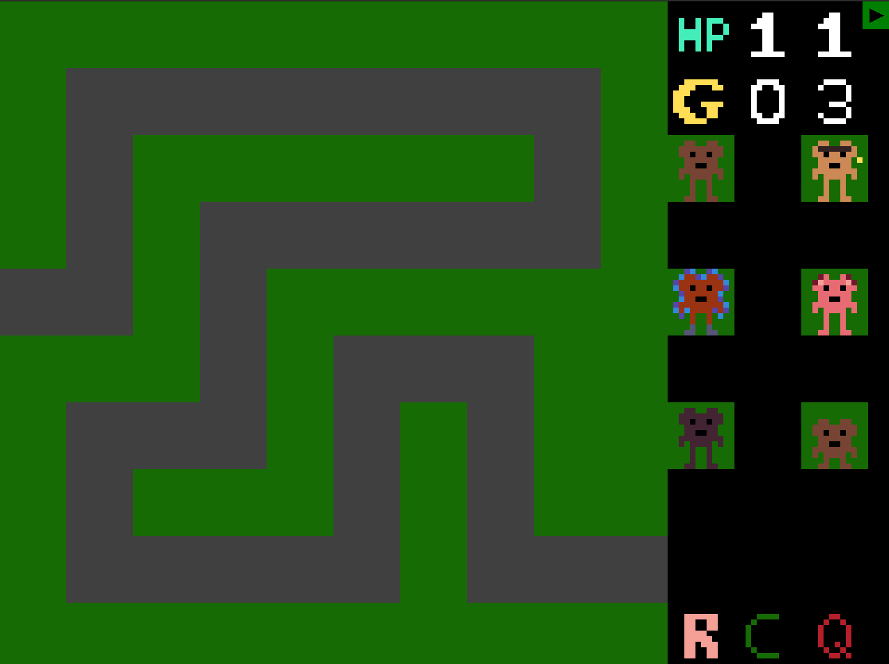

  
  <h1>monkey computer</h1>

Projekt som genomfördes inom kursen [Datorkonstruktion (TSEA83)](https://studieinfo.liu.se/kurs/TSEA83/vt-2024) på Linköpings universitet. Målet med projektet var att bygga en fungerande dator med hjälp av ett Basys3 FPGA-kort.

Det implementerades även ett Tower-Defense spel för den egenbyggda datorn.
